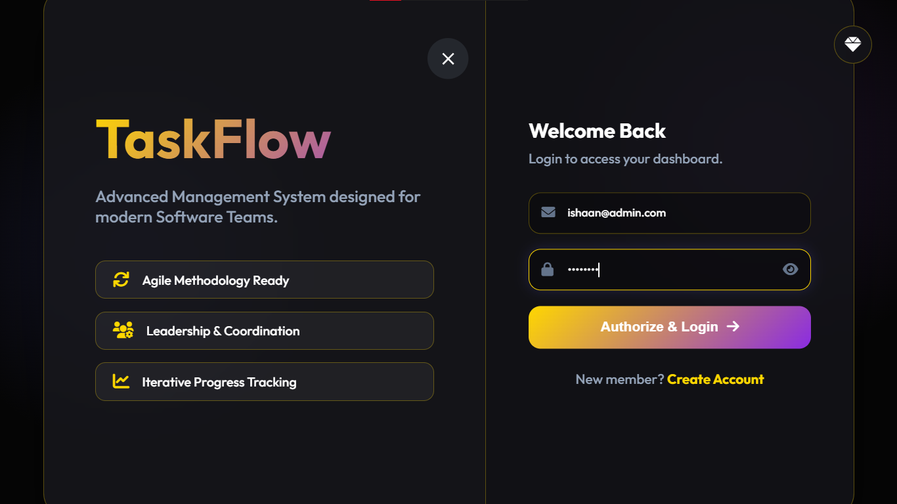
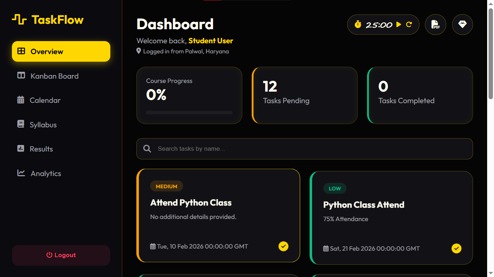
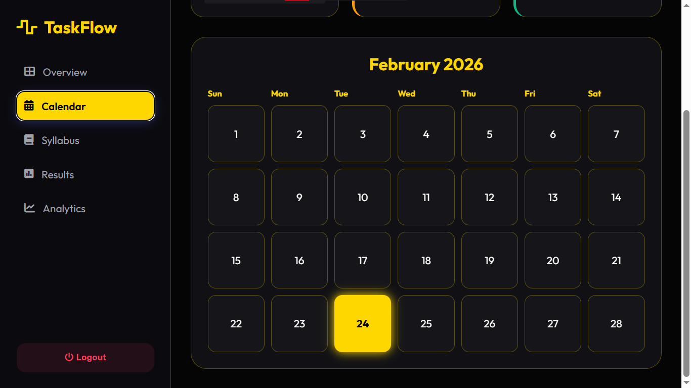
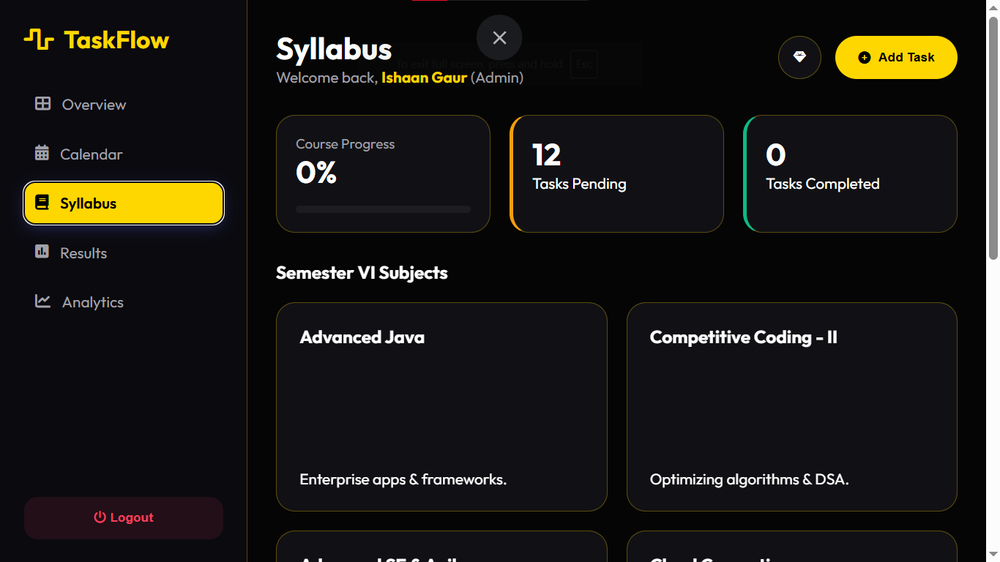
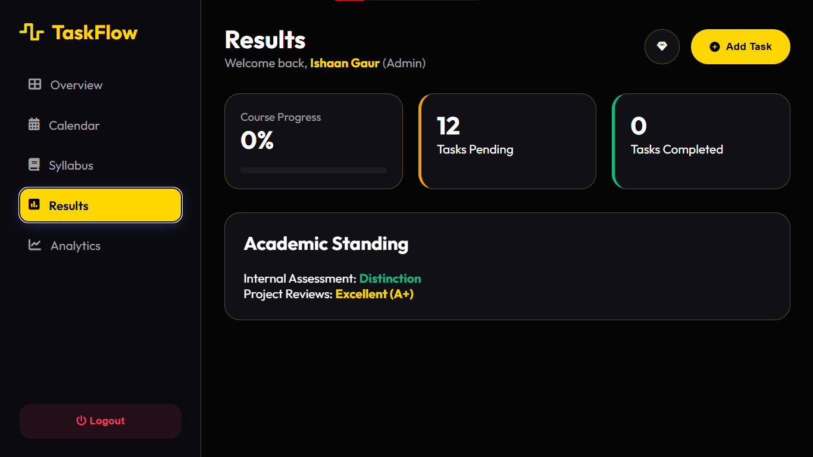
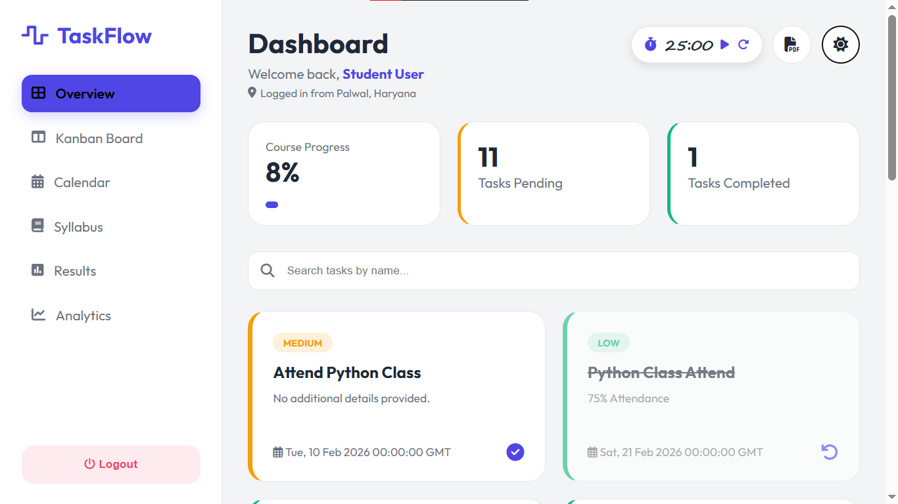

# 🌊 TaskFlow - Modern Task Management System

<p align="center">
  
  
  
  
  
</p>

TaskFlow ek high-performance web application hai jo **Glassmorphism UI** par mabni hai. Ise specifically productivity aur aesthetics ko dhyan mein rakh kar banaya gaya hai.

---

## 📸 Visual Showcase (Project Gallery)

Yahan aap project ka interface aur design dekh sakte hain:

<table border="0">
  <tr>
    <td width="50%"><b>🔐 Secure Login</b></td>
    <td width="50%"><b>📊 Overview Dashboard</b></td>
  </tr>
  <tr>
    <td></td>
    <td></td>
  </tr>
  <tr>
    <td><b>📅 Interactive Calendar</b></td>
    <td><b>📚 Academic Syllabus</b></td>
  </tr>
  <tr>
    <td></td>
    <td></td>
  </tr>
  <tr>
    <td><b>🏆 Results & Analytics</b></td>
    <td><b>🎨 UI Prototype</b></td>
  </tr>
  <tr>
    <td></td>
    <td></td>
  </tr>
</table>

---

## 🎯 Key Features

### ✨ Modern UI/UX
* **Glassmorphism Design:** Frosted glass effect aur soft gradients ka upyog.
* **Fully Responsive:** Laptop ho ya mobile, interface har jagah perfect dikhta hai.
* **Smart Notifications:** Task update hone par dynamic toast messages.

### 📝 Task Management
* **Advanced CRUD:** Create, Edit, aur Delete tasks smoothly.
* **Priority Tracking:** Tasks ko `High`, `Medium`, aur `Low` priority mein set karein.
* **Status Monitoring:** Check karein kaunse tasks `Pending` hain aur kaunse `Completed`.
* **Due Dates:** Har task ke liye deadline set karne ki suvidha.

---

## 🛠️ Tech Stack

| Layer | Technology |
| :--- | :--- |
| **Backend** | Python 3.8+, Flask Framework |
| **Database** | MySQL 8.0 |
| **Frontend** | HTML5, CSS3 (Glassmorphism), JavaScript |
| **Icons** | FontAwesome & Shields.io |

---

## ⚙️ Installation Guide

### **Step 1: Clone the Project**
```bash
git clone [https://github.com/itsme-ishaan/TaskFlow.git](https://github.com/itsme-ishaan/TaskFlow.git)
cd TaskFlow
