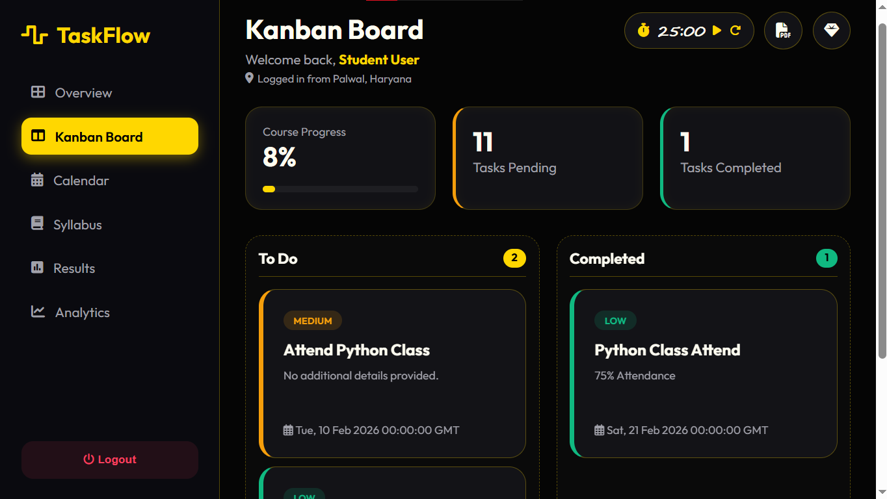
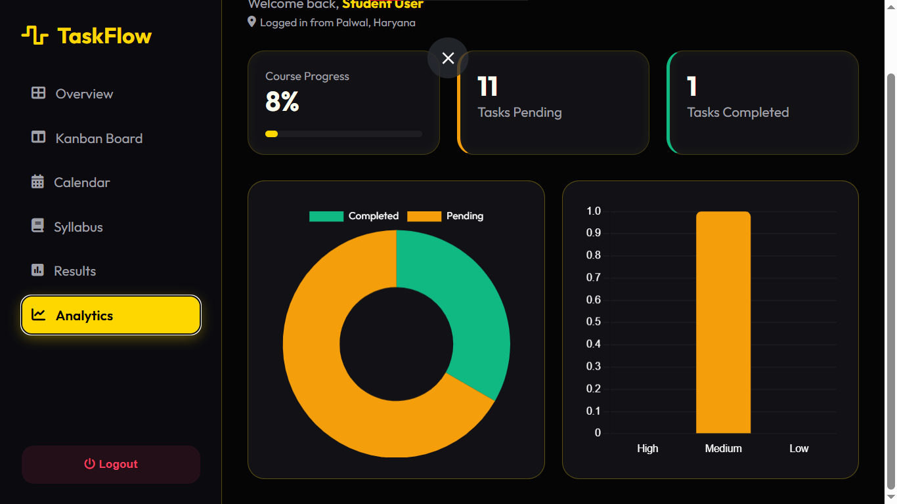

# 🌊 TaskFlow - Advanced Task Management System

<p align="center">
  
  
  
  
  
</p>

TaskFlow ek high-performance web application hai jo **Glassmorphism UI** par mabni hai. Ise specifically productivity, agile methodology, aur aesthetic design ko dhyan mein rakh kar banaya gaya hai.

---

## 📸 Visual Showcase (Project Gallery)

Yahan aap project ka interface aur design dekh sakte hain:

<table border="0">
  <tr>
    <td width="50%"><b>🔐 Secure Gateway (Login)</b></td>
    <td width="50%"><b>📊 Overview Dashboard</b></td>
  </tr>
  <tr>
    <td></td>
    <td></td>
  </tr>
  <tr>
    <td><b>🗂️ Drag & Drop Kanban Board</b></td>
    <td><b>📈 Real-time Analytics</b></td>
  </tr>
  <tr>
    <td></td>
    <td></td>
  </tr>
  <tr>
    <td><b>📅 Interactive Calendar</b></td>
    <td><b>📚 Academic Syllabus</b></td>
  </tr>
  <tr>
    <td></td>
    <td></td>
  </tr>
  <tr>
    <td><b>🏆 Results & Standing</b></td>
    <td><b>🎨 UI Prototype Concept</b></td>
  </tr>
  <tr>
    <td></td>
    <td></td>
  </tr>
</table>

---

## 🎯 Key Features

### ✨ Modern UI/UX
* **Glassmorphism Design:** Frosted glass effect aur soft gradients ka upyog.
* **Tri-state Theme Engine:** Dark, Light aur Premium themes ke beech seamless switching.
* **Smart Notifications:** Task update hone par dynamic toast messages.

### 📝 Advanced Task Management
* **Kanban Layout:** Tasks ko drag-and-drop karke 'To-Do' se 'Done' mein move karein.
* **Role-Based Access Control (RBAC):** Admin (Project Manager) tasks assign kar sakta hai, aur Student unhe execute kar sakta hai.
* **Priority Tracking:** Tasks ko `High`, `Medium`, aur `Low` priority mein set karein (Color-coded borders ke sath).

### 🚀 Productivity Tools
* **Pomodoro Timer:** Focus badhane ke liye inbuilt 25-minute timer.
* **Chart.js Analytics:** Tasks completion aur priority ka visual representation.
* **Export PDF:** One-click mein apne dashboard ka PDF report generate karein.

---

## 🛠️ Tech Stack

| Layer | Technology |
| :--- | :--- |
| **Backend** | Python 3.8+, Flask Framework |
| **Database** | MySQL 8.0 |
| **Frontend** | HTML5, CSS3 (Glassmorphism), JavaScript (Vanilla) |
| **Libraries** | Chart.js (Analytics), HTML2PDF.js (Reporting) |
| **Icons** | FontAwesome & Shields.io |

---

## ⚙️ Installation Guide

### **Step 1: Clone the Project**
```bash
git clone [https://github.com/itsme-ishaan/TaskFlow.git](https://github.com/itsme-ishaan/TaskFlow.git)
cd TaskFlow